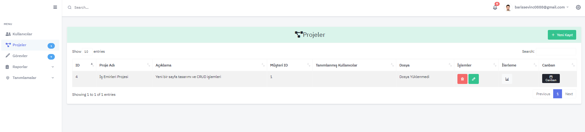
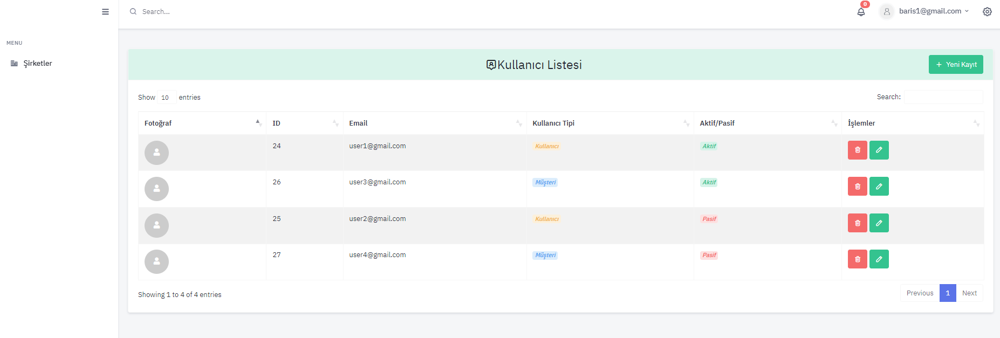
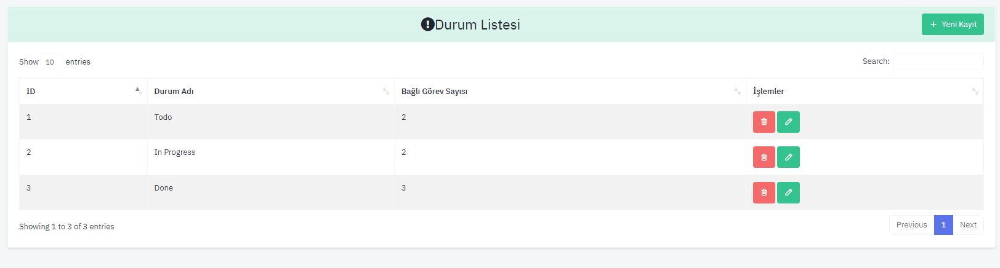
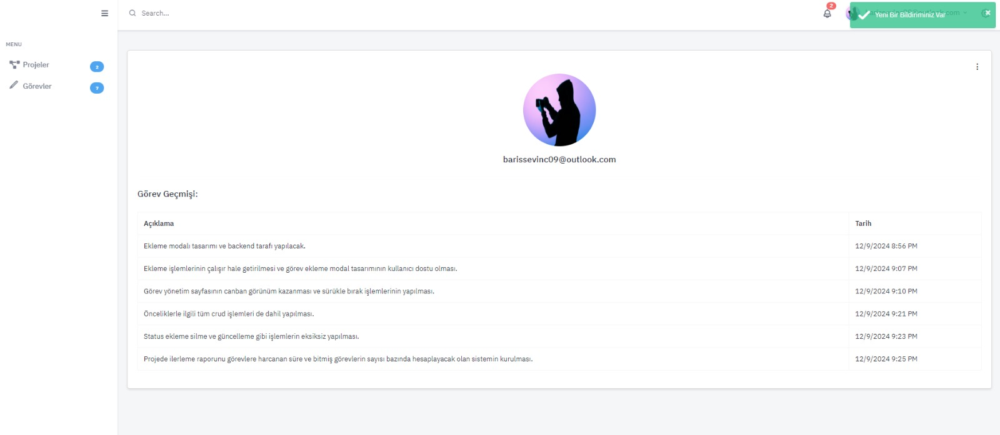
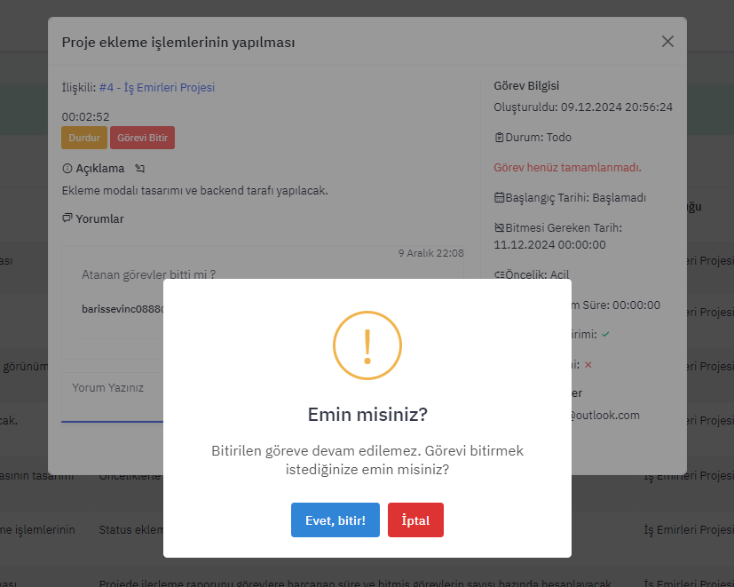
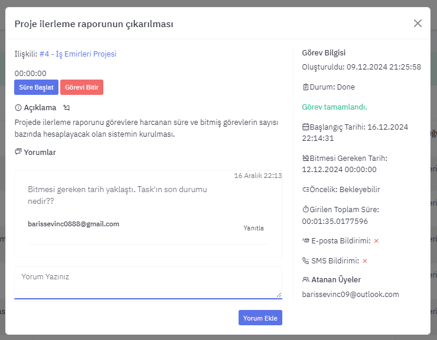
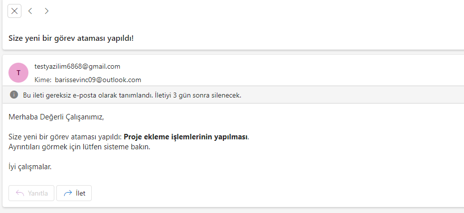

# İş Emirleri Project
## Overview
This project is a task tracking system designed for project management. It allows users to efficiently track and manage their projects.

## Project Link
You can visit the project's main page here: [isemirleri.com.tr](https://isemirleri.com.tr)

## Technologies and Architectures Used

The following technologies and architectural patterns were used in this project:

- **N-Tier (Layered) Architecture**:
  - The application is divided into Presentation, Business Logic, Data Access, and Database layers.
  
- **C# and ASP.NET Core**:
  - Used for backend development and web application creation.
  
- **Entity Framework Core**:
  - Used for database operations.
  
- **SQL**:
  - Used for database management.
  
- **SignalR**:
  - Used for real-time notification management.
  
- **UI Technologies**:
  - **HTML**, **CSS**, **JavaScript**, **AJAX**, and **jQuery** were used to develop the user interface.
  
- **REST API**:
  - Developed for external and internal communication.

    
## Discover Our Project

To learn more about the details of our project, please watch our video:

[Watch the Video](https://www.loom.com/share/76542971ef1e46068bf593f80437376e)

## Project Screenshots

### Database Diagram

### Home Page

### Login Page

### Canban Page & Drag and Drop

### Projects Page

### Users Page

### Customer => Users Page

### Status Page

### Task History and User Profile Page

### Add Task Modal

### Add Project Modal

### Sweet Alert

### Task Modal Detail

### Task E-Mail Detail

